# AO3 Progress Bookmark

AO3 Progress Bookmark is a chrome extension designed to enable bookmarking precisely at the page scroll position of [Archive of Our Own](https://archiveofourown.org/) (AO3)'s works.

This extension is not meant to replace the AO3 bookmark feature. Instead, it serves as a temporary place for readers to keep track of their reading progress (Think of it as a tool to manage the numerous AO3 tabs you had opened, which you would want return to where you left off at a later time).

For permanent saving of an AO3 work for future reference, I recommend using AO3's built-in bookmark feature.

## Installation

[Install for Chrome](https://chrome.google.com/webstore/detail/ao3-progress-bookmark/nkfjlcgomdfkeidpmabelidfegeabglc)

## Features

### **Feature: Bookmark Reading Progress**

Bookmarks at a specific scroll position within the content area (Only a single progress bookmark is allowed for every work)

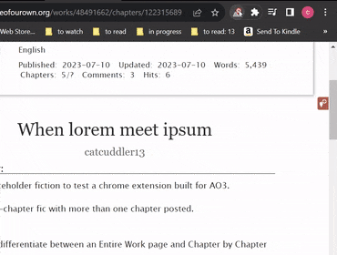

Return to the bookmarked location from anywhere easily via the popup window interface.

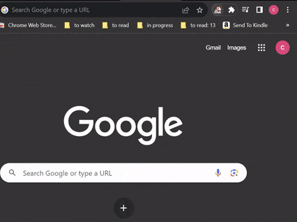

### **Feature: Popup Window**

Lists all progress bookmarks you've created via this extension.

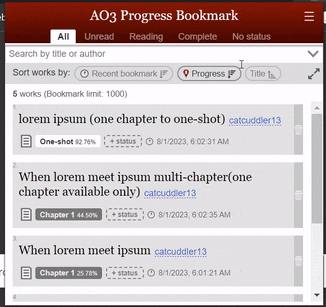

Accesses the setting page to customise your extension appearance under the AO3 work page.

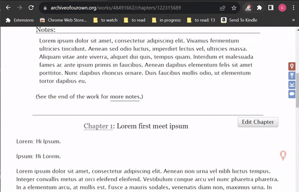

### **Feature: Preview page**

The preview page serves as a local backup for the bookmarked chapter/one-shot in case AO3 becomes temporarily inaccessible. The backup is performed during the creation/update of the bookmark.

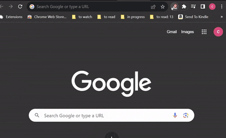

The backup will always be performed for a single chapter/one-shot, regardless of whether the page is in an Entire work view or not at the time of creating/updating the bookmark.

Note: The preview page is only available for bookmarked chapter/one-shot that do not exceed 102,000 text characters **upon compression** (sufficient for most AO3 chapter/one-shot pages containing approximately 90,000 English words or less).

Bookmarks that failed to meet the backup limit will show below message:

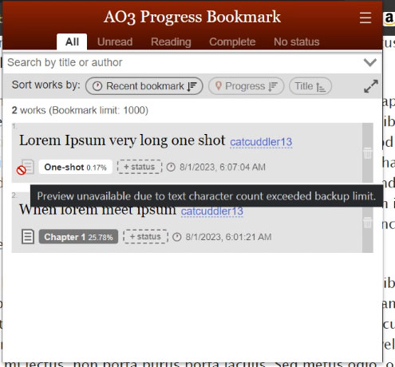

## Bookmark precision

The accuracy of bookmark placement is based on a percentage of the content height, rather than being tied to a specific paragraph. Therefore, when the browser is resized, the bookmark's visual position may be shifted slightly, spanning a few lines of nearby paragraph. However, the scroll position should remain in close proximity to the paragraph where you initially intended to place the bookmark.

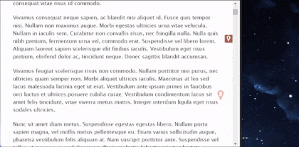

## **Optional UI enhancements**

Features under optional UI enhancements are deactivated by default, they can be activated from the settings panel under the popup window:

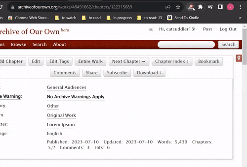

### **UI enhancement: Chapter Progress Bar**

An overview of your current scroll position, visual indication of bookmark's location(if any), easy navigation between chapters.

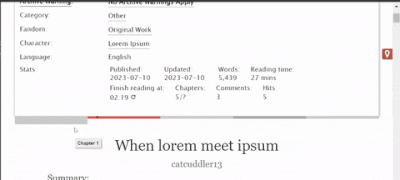

### **UI enhancement: Extra Navigation Buttons**

Useful shortcut buttons to jump to commonly viewed page sections(e.g. back to top, comment section, other chapters.)

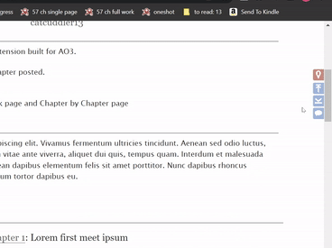

## Build
If you would like to try to build this extension by yourself, follows below steps:
1. Initialises the dev environment by installing dependencies via `npm install`.
2. `npm run build` to generate a **dist** folder under the root directory of this project.
3. Visits `chrome://extensions/`
4. Enables Developer mode for chrome by toggling the **Developer mode** toggle button available in `chrome://extensions/`.
3. Loads the **dist** folder into Chrome via **Load unpacked** button available in `chrome://extensions/`.

## Q & A

  
What happen to my bookmark records when I uninstall the extension?

  
  - When the extension is uninstalled, all bookmark records will be cleared from the local storage, resulting in the loss of your bookmarks. If you plan to reinstall the extension, it is advisable to download the bookmark records' .json file before uninstall.
  
  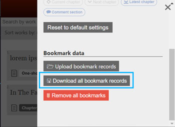
  
  Later, after reinstalling the extension, you can reimport the downloaded .json file to retain your bookmarks.

  
Are the bookmark records tied to my AO3 account?

  
  - No. The bookmark records are tied to your browser profile.

  
What happen when I switch to a different browser profile?

  
  - If you switch to a different browser profile, you won't be able to access the bookmark records that are created by the old browser profile.

  
Is it possible for different browser profiles to share the same bookmark records?

  
  - No, different browser profiles cannot access the same bookmark records(unless you manually migrate the data by downloading from one profile and re-uploading it to another). Each browser profile is assigned a separate storage space where it keeps its own dedicated bookmark records. These records are only accessible to the specific browser profile that creates them.

  
How do I migrate my bookmark records to a different browser profile?

  - To migrate your bookmark records to a new browser profile, follow these steps:
    1. Download the bookmark records (it will be a .json file)
    2. Switch to the desired browser profile
    3. Import the downloaded .json file
    4. Bookmark records are now accessible for the new profile

  
What is the reason for imposing a maximum limit of 1000 bookmarks?

  - The bookmark limit is tested to prevent excessive computing/memory resource usage.

  
What happen when the maximum bookmark limit (1000 bookmark records) is reached?

  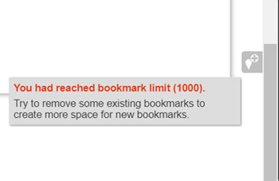

  - You will not be able to add any new bookmarks. If you want to add more bookmarks, you will need to remove some of the existing ones to free up space.

## Future improvement
- More browser supports

## Disclaimers
Any bookmark data you create/update using the extension is exclusively stored on your local device. The extension operates without any need for remote data collection and does not perform such actions to fulfill its functionalities.

## Acknowledgement
The AO3 Progress Bookmark logo combines an originally designed "location" icon with the Archive Of Our Own logo.
